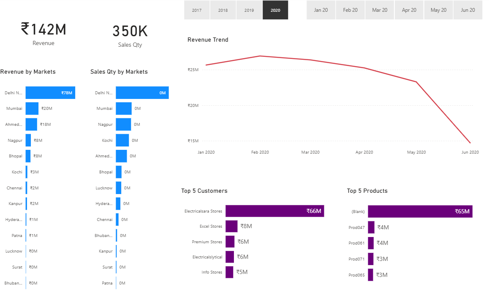
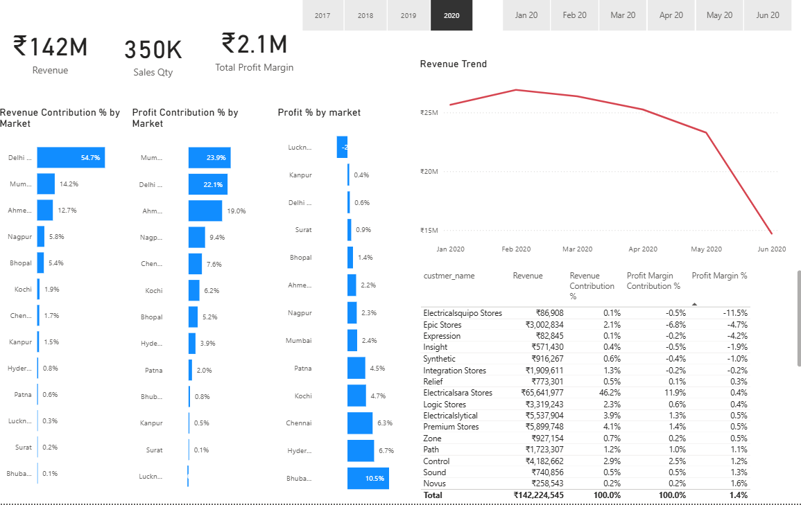
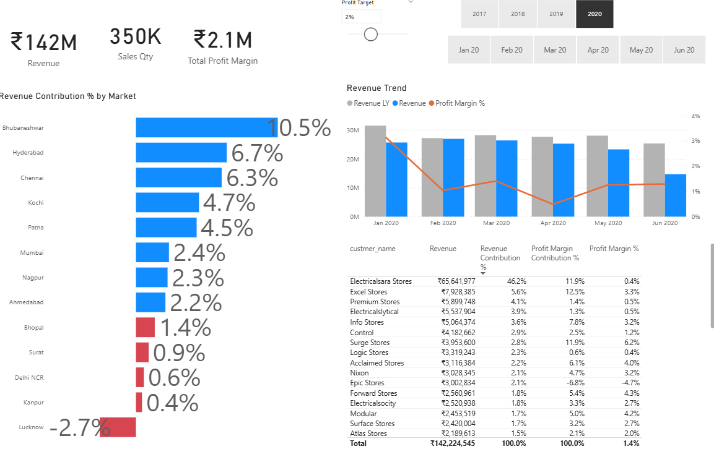

## 📊 Data-Driven_Supply_&_Chain_Sales_Analysis

## 📊 Project Overview
This project analyzes a company's sales data across customers, markets, products, and transactions to generate actionable business insights.

Using SQL for data exploration and Power BI for interactive dashboards, the project identifies revenue trends, high-performing markets, customer distribution, and product performance.

The goal is to simulate a real-world business intelligence scenario where raw sales data is transformed into data-driven insights for decision making.

## 🎯Business Problem
- Which markets generate the most revenue
- Which products drive sales
- Which customers contribute most to revenue
- How sales trends change over time

This project solves these challenges by building a complete data analysis pipeline from raw database queries to a visual analytics dashboard.

## 📌 Project Steps

1. Data Collection

2. Database Setup (MySQL)

3. Data Exploration using SQL

4. Data Cleaning & Transformation

5. Exploratory Data Analysis (EDA)

6. Data Modeling in Power BI

7. Dashboard Development

8. KPI & Business Insights Generation

9. Data Visualization and Reporting

10. Project Documentation and GitHub Upload

## Tools Used
- SQL
- MySQL
- Power BI
- Power Query 
- GitHub 
   

## Key Metrics
- Total Revenue
- Revenue by Market
- Revenue Trend Over Time
- Top Performing Products
- Customer Distribution
- Total Transactions
- Sales by Currency
- Market-wise Sales Performance
- Product-wise Revenue Contribution

## 📈Power BI Dashboard

The Power BI dashboard provides an interactive visualization of key business metrics.

Key Dashboard KPIs: 
💰 Total Revenue
🌍 Revenue by Market
📦 Sales by Product
📊 Revenue Trend Over Time
👥 Customer Segmentation
## 📊 Insights

Highest revenue is generated from a few key markets.
Certain products contribute significantly more to total sales.
Sales performance varies across different regions.
Customer segments show different purchasing patterns.
Some transactions contain invalid or negative sales values.
Revenue trends indicate fluctuations across different time periods.

## Dashboard Preview

## Key Insights

## Profit Analysis

## Performance Insights

